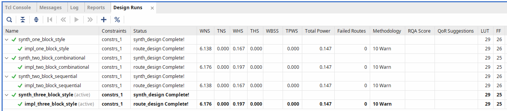

# SystemVerilog FSM Style Comparison for UART Transmitter

This project provides a comprehensive comparison of different FSM (Finite State Machine) coding styles in SystemVerilog, using a UART transmitter as the example design. It is intended to be used with Xilinx Vivado.

The following FSM styles are compared:
-   One-block
-   Two-block
-   Three-block

> All implementations pass the same gate-level simulation tests, ensuring functional equivalence.

## Project Structure

The repository is organized as follows:
```
.
├── LICENSE              # License file
├── NOTICE               # Notice file
├── README.md            # This file
├── vivado/              # Vivado project directory
├── src/                 # HDL source files
│   ├── one_block_style/
│   ├── two_block_combinational/
│   ├── two_block_sequential/
│   └── three_block_style/
├── tb/                  # Testbench files
├── scripts/             # Tcl scripts for automation
└── constraints/         # Constraints files (XDC)
```

## How to Use

To create the Vivado project and run simulations, follow these steps.

### Prerequisites
- Xilinx Vivado (tested with version 2024.2)

### Project Creation
1.  Clone the repository.
2.  Open a terminal or command prompt and navigate to the root of the cloned repository.
3.  Run the project creation script using Vivado in batch mode:
    ```sh
    vivado -mode batch -source ./scripts/create_project.tcl
    ```
4.  This will create a Vivado project in the `vivado` directory.

### Running Simulations
The project is configured with multiple simulation sets, one for each FSM style.

1.  Open the created project in the Vivado GUI.
2.  In the "Sources" window, you will see multiple simulation sets (e.g., `sim_three_block_style`).
3.  Right-click on the desired simulation set and select **"Make Active"**.
4.  Click "Run Simulation" to run the testbench for the selected FSM style.

## Useful Commands

### Synthesis and Implementation
To run synthesis for all FSM styles:
```tcl
launch_runs [get_runs synth_*]
```

To run implementation for all styles (after synthesis):
```tcl
launch_runs [get_runs impl_*]
```

To run synthesis and implementation sequentially:
```tcl
launch_runs [get_runs synth_*] -to_step write_bitstream
```

### Simulation
To run simulation for a specific style (e.g., three_block_style):
```tcl
launch_simulation -simset sim_three_block_style
```

### Reports and Analysis
To generate reports comparing all implementations, you need to open each implemented design first:

For a single implementation (e.g., three_block_style):
```tcl
open_run impl_three_block_style
report_utilization -file utilization_three_block.rpt
report_timing_summary -file timing_three_block.rpt
```

## Design Runs Analysis

This section provides a comprehensive analysis of the synthesis and implementation results for different FSM coding styles. All implementations target the same UART transmitter functionality and use identical constraints.

### Implementation Results Summary



| FSM Style               | WNS (ns) | TNS (ns) | WHS (ns) | THS (ns) | WBRS | TPWS | Total Power (W) | Failed Routes | Methodology Violations | LUT | FF |
| ----------------------- | -------- | -------- | -------- | -------- | ---- | ---- | --------------- | ------------- | ---------------------- | --- | -- |
| One Block               | 6.138    | 0        | \-       | 0.167    | 0    | 0    | 0.147           | 0             | 10 Warn                | 29  | 26 |
| Two Block Combinational | 6.176    | 0        | \-       | 0.197    | 0    | 0    | 0.147           | 0             | 10 Warn                | 29  | 25 |
| Two Block Sequential    | 6.138    | 0        | \-       | 0.167    | 0    | 0    | 0.147           | 0             | 10 Warn                | 29  | 26 |
| Three Block             | 6.176    | 0        | \-       | 0.197    | 0    | 0    | 0.147           | 0             | 10 Warn                | 29  | 25 |

### Key Findings

#### Timing Performance
- **Worst Negative Slack (WNS)**: All implementations achieve positive slack, indicating timing requirements are met
  - Two Block Combinational and Three Block styles show slightly better WNS (6.176 ns vs 6.138 ns)
  - All designs have zero Total Negative Slack (TNS), confirming no timing violations

#### Resource Utilization
- **LUT Usage**: Consistent across all styles (29 LUTs)
- **Flip-Flop Usage**: 
  - Two Block Combinational and Three Block: 25 FFs
  - One Block and Two Block Sequential: 26 FFs
  - The combinational and three-block styles show 1 FF savings


### Recommendations
> The minimal differences in implementation results demonstrate that FSM coding style choice should prioritize code readability, maintainability, and team preferences rather than performance concerns for this particular design complexity.
